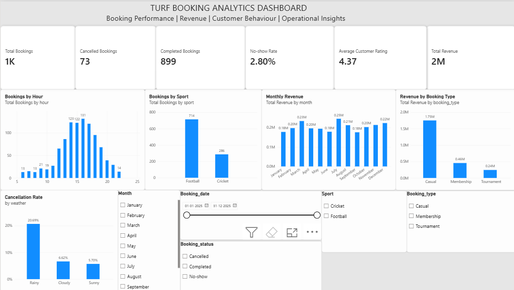
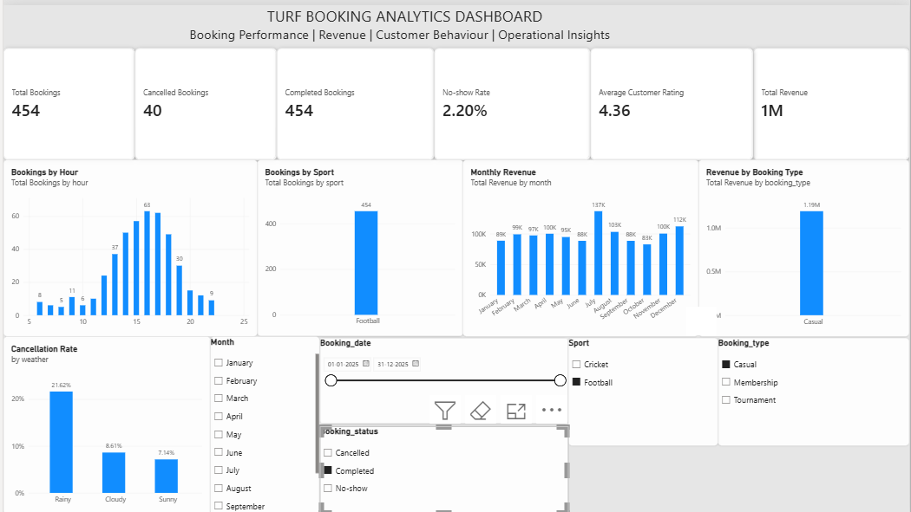

#  Turf Booking Analytics Dashboard

An interactive data analytics project focused on analyzing **turf booking patterns, revenue performance, customer behaviour, and operational insights** using Python and Microsoft Power BI.

##  Dashboard Preview



### Filtered Dashboard



##  Project Overview

This project analyzes a **synthetic turf booking dataset** containing information about bookings, sports, booking types, booking status, dates, weather conditions, customer ratings, duration, hourly rates, players, payment methods, and revenue.

The analysis was used to build an interactive **Power BI dashboard** that allows users to explore booking performance and identify patterns across different dimensions.

##  Objectives

- Analyze overall turf booking performance
- Understand booking trends across different hours and months
- Compare bookings across sports
- Analyze revenue by booking type
- Examine cancellation rates under different weather conditions
- Track completed, cancelled, and no-show bookings
- Analyze customer ratings
- Provide interactive filtering for deeper analysis

##  Tools & Technologies

| Tool | Purpose |
|---|---|
| **Python** | Data analysis and visualization |
| **Pandas** | Data manipulation and analysis |
| **SQL / MySQL** | Database connectivity and data handling |
| **Microsoft Power BI** | Interactive dashboard and visualization |
| **CSV** | Dataset storage |

##  Key Performance Indicators

The dashboard tracks the following KPIs:

- **Total Bookings**
- **Cancelled Bookings**
- **Completed Bookings**
- **No-show Rate**
- **Average Customer Rating**
- **Total Revenue**

##  Dashboard Visualizations

The dashboard includes:

- **Bookings by Hour**
- **Bookings by Sport**
- **Monthly Revenue**
- **Revenue by Booking Type**
- **Cancellation Rate by Weather**

##  Interactive Filters

Users can interact with the dashboard using:

- **Sport**
- **Month**
- **Booking Type**
- **Booking Status**
- **Booking Date**

These filters dynamically update the dashboard visuals and KPIs.

##  Dataset

The project uses a synthetic turf booking dataset.

### Dataset Fields

- Booking Date
- Booking Status
- Booking Type
- Sport
- Customer Rating
- Duration
- Hour
- Hourly Rate
- Players
- Payment Method
- Weather
- Month
- Revenue / Booking Amount

**Dataset:** `turf_bookings_synthetic.csv`

##  Project Structure

```text
Turf-Booking-Analytics/
│
├── Turf_Booking_Analytics.pbix
├── turf_bookings_synthetic.csv
├── data_analytics.py
├── visualizations.py
├── insights.py
├── README.md
├── .gitignore
│
└── Screenshots/
    ├── dashboard.png
    ├── dashboard_filtered.png
    ├── PowerBI.png
    └── Slicers.png